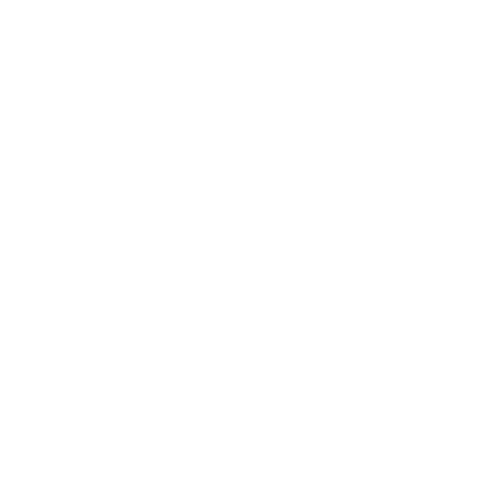

# GReyAlOs

<a name="readme-top"></a>

[![Contributors][contributors-shield]][contributors-url]
[![Forks][forks-shield]][forks-url]
[![Stargazers][stars-shield]][stars-url]
[![Issues][issues-shield]][issues-url]
[![MIT License][license-shield]][license-url]
[![LinkedIn][linkedin-shield]][linkedin-url]


<!-- PROJECT LOGO -->
<br />
<div align="center">
  <a href="https://github.com/othneildrew/Best-README-Template">
    
  </a>

  <h3 align="center">GReyAlOs-README</h3>

  <p align="center">
    README de Sitio web de empresa ficticia "GReyAlOs" para la materia de Tecnologías Emergentes
    <br />
    <a href="https://github.com/Gerardo-R/GReyAlOs"><strong>Explorar los documentos »</strong></a>
    <br />
    <br />
    <a href="https://gerardo-r.github.io/GReyAlOs/">Ver Demo del Sitio Web</a>
    ·
    <a href="https://github.com/Gerardo-R/GReyAlOs/issues">Reportar Error</a>
    ·
    <a href="https://github.com/Gerardo-R/GReyAlOs/issues">Solicitar cambio</a>
  </p>
</div>


<!-- TABLE OF CONTENTS -->
<details>
  <summary>Tabla de Contenido</summary>
  <ol>
    <li>
      <a href="#acerca-del-proyecto">Acerca del Proyecto</a>
      <ul>
        <li><a href="#construído-con">Construído con</a></li>
      </ul>
    </li>
    <li>
      <a href="#primeros-pasos">Primeros pasos</a>
      <ul>
        <li><a href="#prerrequisitos">Prerrequisitos</a></li>
        <li><a href="#instalación">Instalación</a></li>
      </ul>
    </li>
    <li><a href="#uso">Uso</a></li>
    <li><a href="#licencia">Licencia</a></li>
    <li><a href="#contacto">Contacto</a></li>
    <li><a href="#créditos">Créditos</a></li>
  </ol>
</details>


<!-- ABOUT THE PROJECT -->
## Acerca del proyecto

Proyecto de sitio web para una empresa de desarrollo de software a la medida, que implementa un formulario de correo con reCAPTCHA y que se envía gracias a Formspree.
Es un trabajo para la materia Tecnologías Emergentes.
<br>
<br>
<a href="https://github.com/Gerardo-R/GReyAlOs/blob/main/readme/greyalos-web_pagina-principal.png">

</a>

<p align="right">(<a href="#readme-top">back to top</a>)</p>


### Construído con

This section should list any major frameworks/libraries used to bootstrap your project. Leave any add-ons/plugins for the acknowledgements section. Here are a few examples.
*   
*   
*   
*   
*   
*   
*   


<p align="right">(<a href="#readme-top">back to top</a>)</p>


<!-- GETTING STARTED -->
## Primeros pasos

### Prerrequisitos

1. Tener instalado Visual Studio Code o cualquier otro software que permita abrir el proyecto y editar el código.
2. Crear una cuenta en [Formspree](https://formspree.io/) y crear un nuevo proyecto.
3. En el proyecto de Formspree, configurar la cuenta de correo a la que se enviarán los formularios.
4. Entrar a [Font Awesome](https://fontawesome.com/start), ingresar nuestro email para registrarse en el sitio y recibir un código de kit de iconos gratuito.


### Instalación

A continuación se describen los pasos para la correcta instalación del proyecto.

1. Clonar o [descargar](https://github.com/Gerardo-R/GReyAlOs/archive/refs/heads/main.zip) el repositorio.

```sh
  git clone Gerardo-R/GReyAlOs
```

2. En el archivo "contacto.html":
   - Reemplazar el código de kit obtenido de Font Awesome:  
   ```html
      <script src="https://kit.fontawesome.com/codigo.js" crossorigin="anonymous"></script>
   ```  
   - Reemplazar el código de formulario de Formspree con el obtenido al crear un proyecto en Formspree:  
   ```html
    <form id="contact-form" action="https://formspree.io/f/codigo" method="post">
   ```
  
 3. Entrar a [reCAPTCHA admin](https://www.google.com/recaptcha/admin/create) y rellenar el formulario para obtener credenciales para reCAPTCHA v3. En el formulario hay que agregar el dominio que tendrá el sitio web publicado para que funcione reCAPTCHA.
 
4. En el archivo "contacto.html":
   - Reemplazar la clave del sitio con la obtenida a través de reCAPTCHA:  
  ```html
    <script src="https://www.google.com/recaptcha/api.js?render=clave-de-sitio"></script>
    ...
    <button class="g-recaptcha" data-sitekey="clave-de-sitio" data-callback='onSubmit' data-action='submit'>Enviar</button>
  ```
  
 5. Publicar el sitio web.
  

<p align="right">(<a href="#readme-top">back to top</a>)</p>


<!-- USAGE EXAMPLES -->
## Uso

A continuación se presenta la manera en que funciona el sitio web, específicamente sobre el envío del formulario.
<br>
Para ver la demostración del sitio web completo ver el siguiente [video](https://youtu.be/6xTIjFRxwJw)
<br><br>

Primero se ingresa al sitio de "[GReyAlOs](https://gerardo-r.github.io/GReyAlOs/)".
<br><br>
<a href="https://github.com/Gerardo-R/GReyAlOs/blob/main/readme/greyalos-web_pagina-principal.png">

</a>
<br><br>

Se da clic en el botón del menú lateral para mostrar las opciones.
<br><br>
<a href="https://github.com/Gerardo-R/GReyAlOs/blob/main/readme/greyalos-web_pagina-principal_menu-lateral-resaltado.png">

</a>
<br><br>

Se muestran las opciones de la página a la que se quiere ir.
<br>
Como el formulario está en la página de Contacto se da clic en Contacto.
<br><br>
<a href="https://github.com/Gerardo-R/GReyAlOs/blob/main/readme/greyalos-web_pagina-principal_cursor-encima-de-contacto.png">

</a>
<br><br>

Esto dirige a la página de Contacto.
<br><br>
<a href="https://github.com/Gerardo-R/GReyAlOs/blob/main/readme/greyalos-web_pagina-contacto.png">

</a>
<br><br>

Se rellenan los campos del formulario. Para este ejemplo se rellenó con los siguientes datos:
<br>
 - Nombre: Gerardo.
 - Correo: gerardoreyna968@gmail.com.
 - Mensaje: Prueba de envío de formulario.
<br>
<a href="https://github.com/Gerardo-R/GReyAlOs/blob/main/readme/greyalos-web_pagina-contacto_formulario-rellenado.png">

</a>
<br><br>

Se da clic en el botón Enviar, lo cual dirige a la siguiente página que confirma que el formulario fue enviado.
<br><br>
<a href="https://github.com/Gerardo-R/GReyAlOs/blob/main/readme/greyalos-web_pagina-contacto_formulario-enviado.png">

</a>
<br><br>

Se da clic en el texto que dice "Regresar al sitio original" para regresar a la página de Contacto.
<br><br>
Eso es todo lo que hay que hacer para enviar un formulario.
<br><br>
Ahora para ver el formulario enviado se accede al cliente del correo utilizado para Formspree. Dentro se consulta la bandeja de entrada y se abre el correo del formulario recibido.
<br><br>
<a href="https://github.com/Gerardo-R/GReyAlOs/blob/main/readme/greyalos-web_correo-formulario-enviado.png">

</a>
<br><br>

<p align="right">(<a href="#readme-top">back to top</a>)</p>


<!-- LICENSE -->
## Licencia

Distribuido bajo la licencia MIT. Consultar `LICENSE` para más información.

<p align="right">(<a href="#readme-top">back to top</a>)</p>


<!-- CONTACT -->
## Contacto

Gerardo Reyna - gerardoreyna968@gmail.com

[](https://www.linkedin.com/in/gerardo-reyna-199964193/)
[](https://www.youtube.com/channel/UC4uYKo9XeQSIg8iU2KhtQFQ)
[](https://www.instagram.com/zillamxxn/)

Link del proyecto: [https://github.com/Gerardo-R/GReyAlOs](https://github.com/Gerardo-R/GReyAlOs)
<br>
Perfil de GitHub: [Gerardo-R](https://github.com/Gerardo-R/)

<p align="right">(<a href="#readme-top">back to top</a>)</p>


<!-- ACKNOWLEDGMENTS -->
## Créditos

Recursos utilizados.

* [Choose an Open Source License](https://choosealicense.com)
* [Img Shields](https://shields.io)
* [GitHub Pages](https://pages.github.com)
* [Font Awesome](https://fontawesome.com)
* [Agregar reCAPTCHA v3 a formulario](https://www.youtube.com/watch?v=LVN0dOcoEnE)
* [Editor de video](https://www.kapwing.com/)
* [Formspree](https://formspree.io/)
* [OpenStreetMap](https://www.openstreetmap.org/)
* [Leaflet](https://leafletjs.com/)

<p align="right">(<a href="#readme-top">back to top</a>)</p>


<!-- MARKDOWN LINKS & IMAGES -->
<!-- https://www.markdownguide.org/basic-syntax/#reference-style-links -->
[contributors-shield]: https://img.shields.io/github/contributors/Gerardo-R/GReyAlOs.svg?style=for-the-badge
[contributors-url]: https://github.com/Gerardo-R/GReyAlOs/graphs/contributors
[forks-shield]: https://img.shields.io/github/forks/Gerardo-R/GReyAlOs.svg?style=for-the-badge
[forks-url]: https://github.com/Gerardo-R/GReyAlOs/network/members
[stars-shield]: https://img.shields.io/github/stars/Gerardo-R/GReyAlOs.svg?style=for-the-badge
[stars-url]: https://github.com/Gerardo-R/GReyAlOs/stargazers
[issues-shield]: https://img.shields.io/github/issues/Gerardo-R/GReyAlOs.svg?style=for-the-badge
[issues-url]: https://github.com/Gerardo-R/GReyAlOs/issues
[license-shield]: https://img.shields.io/github/license/Gerardo-R/GReyAlOs.svg?style=for-the-badge
[license-url]: https://github.com/Gerardo-R/GReyAlOs/blob/main/LICENSE
[linkedin-shield]: https://img.shields.io/badge/-LinkedIn-black.svg?style=for-the-badge&logo=linkedin&colorB=555
[linkedin-url]: https://www.linkedin.com/in/gerardo-reyna-199964193/
[product-screenshot]: images/screenshot.png

